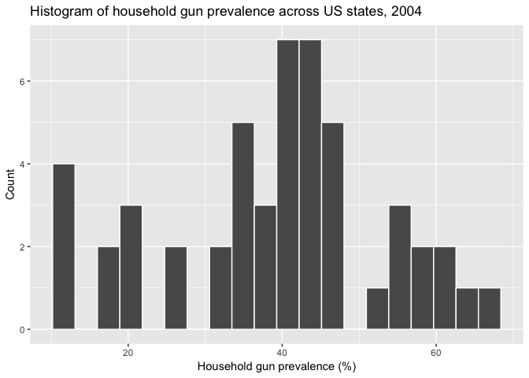

Load and clean the data
================
Corinne Riddell
1/25/2018

### Load the libraries used in the analysis:

``` r
library(data.table) #for reshaping the data
library(tidyverse) #a collection of packages which we use for data manipulation
```

    ## Loading tidyverse: ggplot2
    ## Loading tidyverse: tibble
    ## Loading tidyverse: tidyr
    ## Loading tidyverse: readr
    ## Loading tidyverse: purrr
    ## Loading tidyverse: dplyr

    ## Conflicts with tidy packages ----------------------------------------------

    ## between():   dplyr, data.table
    ## filter():    dplyr, stats
    ## first():     dplyr, data.table
    ## lag():       dplyr, stats
    ## last():      dplyr, data.table
    ## transpose(): purrr, data.table

### Create a dataset of state gun ownership rates based on BRFSS data

The gun household prevalences were estimated previously and can be found in Table 1 of the following article (see the column for 2004): Monuteaux MC, Lee LK, Hemenway D, Mannix R, Fleegler EW. Firearm ownership and violent crime in the us: An ecologic study. *American journal of Preventive Medicine*. 2015;49(2):207-214.

``` r
#These are arranged in alphabetical order, such that the first value is for Alabama and the last value is for Wyoming. 
#DC does not have an estimate in these data.
gun.house.prev <- c(52.2, 59.8, 32.3, 58.8, 20.1, 34.6, 18.1, 26.3, 25.2,
                    40.3, 10.2, 55.7, 20.7, 38.5, 45.7, 42.8, 47.7, 45.0,
                    40.3, 21.7, 11.5, 40.8, 41.2, 54.6, 44.2, 62.6, 45.4,
                    34.0, 31.0, 11.4, 39.7, 18.5, 39.4, 56.2, 34.0, 46.5,
                    39.8, 35.1, 12.4, 43.3, 59.9, 46.6, 37.1, 44.8, 43.8,
                    37.5, 34.0, 58.5, 43.0, 65.5)

#make a dataset with the state abbreviation and their corresponding gun prevalences.
gun.data <- data.frame("ST" = state.abb, "gun.house.prev" = gun.house.prev)

#examine the distribution.
ggplot(gun.data, aes(gun.house.prev)) + 
  geom_histogram(bins = 20, col = "white") + 
  xlab("Household gun prevalence (%)") + ylab("Count") +
  ggtitle("Histogram of household gun prevalence across US states, 2004")
```



``` r
#reorder the dataset from lowest to highest prevalence and categorize prevalence into four bins.
gun.data <- gun.data %>% arrange(gun.house.prev) %>% 
  mutate(gun.house.prev.category = cut(gun.house.prev, 
                                       breaks = c(0, 20, 35, 44.9, 66), 
                                       labels = c("10.2%-19.9%", "20.0%-34.9%", "35.0%-44.9%", "45.0%-65.5%")))

#View(gun.data)
```

### Load the downloaded mortality data from CDC WONDER Online database

We used [CDC WONDER](https://wonder.cdc.gov/) to extract homicide and suicide data. From the homepage select "Detailed mortality" and agree to the terms of use.

**Steps we followed:**

-   Group the results by state and race
-   Select age adjusted rate
-   Under section 3, select "Not Hispanic or Latino" and dual-select "Black and African American" and "White" from the Race dropdown menu
-   Under section 4, select years between 2008 to 2016, inclusive
-   In section 6 you use ICD-10 codes to select causes of death you want to extract. Because we cannot "group by" cause of death in the mortality counts, we need to re-run this step for each cause of death of interest and create four separate datasets.
    -   Start by selecting ICD-10 codes for firearm-related homicide: X93, X94, X95.
-   In section 7, unclick "Show totals" and select "Show zero values" and "Show supressed values"
-   Hit send.
-   After a few seconds, a dataset will be created of the number and rates of firearm-related homicide in each state-race dyad. We saved these data in the Data directory under the title "Homicide\_Firearms\_NH\_Males\_Age-adjusted\_2008-2016.txt"
-   Repeat the process about but modify the selected ICD codes:
    -   X85-X92 and X96-X99 and Y01-Y05 for non-firearm related homicide
    -   X72, X73, X74 for firearm related suicide
    -   X60-X71 and X75-X84 for non-firearm related suicide
-   We also calculated the US overall rates (not by state). We did this by repeating the above process but removing "State" from the "Group by" step in Section 1.

``` r
#load the state-specific datasets:
CDC_NHM_homicide_FA <- read.table("../Data/Raw-data/Homicide_Firearms_NH_Males_Age-adjusted_2008-2016.txt", 
                                  header = T, nrows = 102, sep = "\t") #nrows stops at row 102, the last row of data, before the data notes attached by CDC WONDER.

CDC_NHM_homicide_NFA <- read.table("../Data/Raw-data/Homicide_Non-Firearms_NH_Males_Age-adjusted_2008-2016.txt", 
                                  header = T, nrows = 102, sep = "\t")

CDC_NHM_suicide_FA <- read.table("../Data/Raw-data/Suicide_Firearms_NH_Males_Age-adjusted_2008-2016.txt", 
                                  header = T, nrows = 102, sep = "\t")

CDC_NHM_suicide_NFA <- read.table("../Data/Raw-data/Suicide_Non-Firearms_NH_Males_Age-adjusted_2008-2016.txt", 
                                  header = T, nrows = 102, sep = "\t")

#load US-level data (aggregated across entire US)
US_CDC_NHM_homicide_FA <- read.table("../Data/Raw-data/All-US_Homicide_Firearms_NH_Males_Age-adjusted_2008-2016.txt", 
                                  header = T, nrows = 2, sep = "\t")
US_CDC_NHM_homicide_NFA <- read.table("../Data/Raw-data/All-US_Homicide_Non-Firearms_NH_Males_Age-adjusted_2008-2016.txt", 
                                  header = T, nrows = 2, sep = "\t")
US_CDC_NHM_suicide_FA <- read.table("../Data/Raw-data/All-US_Suicide_Firearms_NH_Males_Age-adjusted_2008-2016.txt", 
                                  header = T, nrows = 2, sep = "\t")
US_CDC_NHM_suicide_NFA <- read.table("../Data/Raw-data/All-US_Suicide_Non-Firearms_NH_Males_Age-adjusted_2008-2016.txt", 
                                  header = T, nrows = 2, sep = "\t")

#Add a variable "State" to the US-level datasets that is necessary for later use.
US_CDC_NHM_homicide_FA$State = "United States"
US_CDC_NHM_homicide_NFA$State = "United States"
US_CDC_NHM_suicide_FA$State = "United States"
US_CDC_NHM_suicide_NFA$State = "United States"
```

### Clean the abstract data and prepare it for analysis

This function cleans the abstracted mortality data that we loaded during the previous step.

``` r
#' Tidy datasets extracted from CDC WONDER
#' @param data The dataset to be cleaned.
#' @param state The name of the state variable in the dataset.
#' @param race The name of the race variable in the dataset.
#' @param death The name of the count of deaths variable in the dataset.
#' @param population The name of the population denominator in the dataset.
#' @param crude The name of the crude mortality rate variable in the dataset.
#' @param adjusted The name of the adjusted mortality rate variable in the dataset.
#' @param intent The intent of the death, homicide or suicide, user-supplied, based on the selected ICD codes.
#' @param mechanism The mechanism used, firearm or non-firearm, user-supplied, based on the selected ICD codes.

tidy_fx_cdc <- function(data, state, race, death, population, crude, adjusted, intent, mechanism) {
  dat2 <- data[, c(state, race, death, population, crude, adjusted)] 
  names(dat2)[3] <- paste0(death, ".", intent) 
  names(dat2)[4] <- paste0(population)
  names(dat2)[5] <- paste0("crude.", intent)
  names(dat2)[6] <- paste0("adjusted.", intent)
  dat2$type = mechanism
  return(dat2)
}
```

The function `tidy_fx_cdc` is used to clean all of the CDC abstracted datasets.

``` r
CDC_NHM_homicide_FA2 <- tidy_fx_cdc(data = CDC_NHM_homicide_FA, state = "State", 
                                    race = "Race",
                                    death = "Deaths", population = "Population", 
                                    crude = "Crude.Rate", adjusted = "Age.Adjusted.Rate", 
                                    intent = "homicide", mechanism = "Firearm")
CDC_NHM_suicide_FA2 <- tidy_fx_cdc(data = CDC_NHM_suicide_FA, state = "State", 
                                    race = "Race",
                                    death = "Deaths", population = "Population", 
                                    crude = "Crude.Rate", adjusted = "Age.Adjusted.Rate", 
                                    intent = "suicide", mechanism = "Firearm")

CDC_NHM_homicide_NFA2 <- tidy_fx_cdc(data = CDC_NHM_homicide_NFA, state = "State", 
                                    race = "Race",
                                    death = "Deaths", population = "Population", 
                                    crude = "Crude.Rate", adjusted = "Age.Adjusted.Rate", 
                                    intent = "homicide", mechanism = "Non-Firearm")
CDC_NHM_suicide_NFA2 <- tidy_fx_cdc(data = CDC_NHM_suicide_NFA, state = "State", 
                                    race = "Race",
                                    death = "Deaths", population = "Population", 
                                    crude = "Crude.Rate", adjusted = "Age.Adjusted.Rate", 
                                    intent = "suicide", mechanism = "Non-Firearm")

US_CDC_NHM_homicide_FA2 <- tidy_fx_cdc(data = US_CDC_NHM_homicide_FA, state = "State", 
                                    death = "Deaths", population = "Population", 
                                    race = "Race",
                                    crude = "Crude.Rate", adjusted = "Age.Adjusted.Rate", 
                                    intent = "homicide", mechanism = "Firearm")
US_CDC_NHM_homicide_NFA2 <- tidy_fx_cdc(data = US_CDC_NHM_homicide_NFA, state = "State", 
                                    race = "Race", 
                                    death = "Deaths", population = "Population", 
                                    crude = "Crude.Rate", adjusted = "Age.Adjusted.Rate", 
                                    intent = "homicide", mechanism = "Non-Firearm")
US_CDC_NHM_suicide_FA2 <- tidy_fx_cdc(data = US_CDC_NHM_suicide_FA, state = "State", 
                                    race = "Race", 
                                    death = "Deaths", population = "Population", 
                                    crude = "Crude.Rate", adjusted = "Age.Adjusted.Rate", 
                                    intent = "suicide", mechanism = "Firearm")
US_CDC_NHM_suicide_NFA2 <- tidy_fx_cdc(data = US_CDC_NHM_suicide_NFA, state = "State", 
                                    race = "Race", 
                                    death = "Deaths", population = "Population", 
                                    crude = "Crude.Rate", adjusted = "Age.Adjusted.Rate", 
                                    intent = "suicide", mechanism = "Non-Firearm")
```

After the previous step, we now have four state-specific datasets, one for each of firearm-related homicide and firearm-related suicide and their non-firearm counterparts. We would like to append the firearm- and non-firearm datasets together using `rbind` and then use `merge` to contain the homicide and suicide data on the same row (i.e., in a wide data format).

The warning messages displayed after the code tell you that the strings "Unreliable" and "Supressed" were replaced by NA (missing) when converted to numeric types.

``` r
#first, we create the wide dataset for the US-level data
US_CDC_NHM_homicide_2 <- rbind(US_CDC_NHM_homicide_FA2, US_CDC_NHM_homicide_NFA2)
US_CDC_NHM_suicide_2 <- rbind(US_CDC_NHM_suicide_FA2, US_CDC_NHM_suicide_NFA2)

rm(US_CDC_NHM_homicide_FA2, US_CDC_NHM_homicide_NFA2, 
   US_CDC_NHM_suicide_FA2, US_CDC_NHM_suicide_NFA2,
   US_CDC_NHM_homicide_FA, US_CDC_NHM_homicide_NFA,
   US_CDC_NHM_suicide_FA, US_CDC_NHM_suicide_NFA)

US_CDC_Males_0816 <- merge(US_CDC_NHM_homicide_2, 
                           US_CDC_NHM_suicide_2, 
                           by = c("State", "Race", "Population", "type"))

US_CDC_Males_0816 <- US_CDC_Males_0816 %>% 
  mutate(Race = plyr::revalue(Race, c("White" = "White",
                                      "Black or African American" = "Black")),
         Population = NA) #set the Population variable to be missing for the US-level data. 
                          #We use this variable to size the plotting points for individual states, but not the US overall.

#repeat the above set of operations for the state-specific datasets
CDC_NHM_homicide_2 <- rbind(CDC_NHM_homicide_FA2, CDC_NHM_homicide_NFA2)
CDC_NHM_suicide_2 <- rbind(CDC_NHM_suicide_FA2, CDC_NHM_suicide_NFA2)

rm(CDC_NHM_homicide_FA2, CDC_NHM_homicide_NFA2, 
   CDC_NHM_suicide_FA2, CDC_NHM_suicide_NFA2,
   CDC_NHM_homicide_FA, CDC_NHM_homicide_NFA, 
   CDC_NHM_suicide_FA, CDC_NHM_suicide_NFA)

CDC_Males_AllAges_0816 <- merge(CDC_NHM_homicide_2, 
                                CDC_NHM_suicide_2, 
                                by = c("State", "Race", "Population", "type"))

CDC_Males_AllAges_0816 <- CDC_Males_AllAges_0816 %>% 
  mutate(Race = plyr::revalue(Race, c("White" = "White",
                                      "Black or African American" = "Black"))) %>%
  mutate_at(.vars = c(5:10), funs(as.numeric(as.character(.)))) #reformat factor variables as numeric. "Supressed" and "Unreliable" get recoded as missing NA.
```

    ## Warning in eval(substitute(expr), envir, enclos): NAs introduced by
    ## coercion

    ## Warning in eval(substitute(expr), envir, enclos): NAs introduced by
    ## coercion

    ## Warning in eval(substitute(expr), envir, enclos): NAs introduced by
    ## coercion

    ## Warning in eval(substitute(expr), envir, enclos): NAs introduced by
    ## coercion

    ## Warning in eval(substitute(expr), envir, enclos): NAs introduced by
    ## coercion

    ## Warning in eval(substitute(expr), envir, enclos): NAs introduced by
    ## coercion

We would also like the dataset to be wide with respect to race so that we can easily calculate rate-differences in homicide and suicide between black and white men. We use the `dcast` function from the `data.table` package to reshape these data from long to wide. This set of commands also brings together the firearm and nonfirearm datasets into one dataset.

``` r
#US-level data first
US_CDC_Males_0816_wide_FA <- dcast(setDT(US_CDC_Males_0816 %>% filter(type == "Firearm")), State ~ Race, 
            value.var = c("Population", "Deaths.homicide", "crude.homicide", "adjusted.homicide",
                          "Deaths.suicide", "crude.suicide", "adjusted.suicide"), sep = ".")
US_CDC_Males_0816_wide_FA$type <- "Firearm"

US_CDC_Males_0816_wide_NFA <- dcast(setDT(US_CDC_Males_0816 %>% filter(type == "Non-Firearm")), State ~ Race, 
            value.var = c("Population", "Deaths.homicide", "crude.homicide", "adjusted.homicide",
                          "Deaths.suicide", "crude.suicide", "adjusted.suicide"), sep = ".")
US_CDC_Males_0816_wide_NFA$type <- "Non-Firearm"

US_CDC_Males_0816_wide <- rbind(US_CDC_Males_0816_wide_FA, US_CDC_Males_0816_wide_NFA)

rm(US_CDC_Males_0816_wide_FA, US_CDC_Males_0816_wide_NFA, US_CDC_NHM_homicide_2, US_CDC_NHM_suicide_2)

#repeat steps for state-level data
CDC_Males_AllAges_0816_wide_FA <- dcast(setDT(CDC_Males_AllAges_0816 %>% filter(type == "Firearm")), State ~ Race, 
                                     value.var = c("Population", "Deaths.homicide", "crude.homicide", "adjusted.homicide",
                                                   "Deaths.suicide", "crude.suicide", "adjusted.suicide"), sep = ".") 
CDC_Males_AllAges_0816_wide_FA$type <- "Firearm"
CDC_Males_AllAges_0816_wide_NFA <- dcast(setDT(CDC_Males_AllAges_0816 %>% filter(type == "Non-Firearm")), State ~ Race, 
                                     value.var = c("Population", "Deaths.homicide", "crude.homicide", "adjusted.homicide",
                                                   "Deaths.suicide", "crude.suicide", "adjusted.suicide"), sep = ".") 
CDC_Males_AllAges_0816_wide_NFA$type <- "Non-Firearm"

CDC_Males_AllAges_0816_wide <- rbind(CDC_Males_AllAges_0816_wide_FA, CDC_Males_AllAges_0816_wide_NFA)

rm(CDC_Males_AllAges_0816_wide_FA, CDC_Males_AllAges_0816_wide_NFA, CDC_NHM_homicide_2, CDC_NHM_suicide_2)
```

We're now ready to append the US-level and state-level datasets. But first, we need to add "United States" as a new factor level of the `State` variable using the `fct_expand` function from the `forcats` package.

``` r
#Add United States as a new factor level
CDC_Males_AllAges_0816_wide <- CDC_Males_AllAges_0816_wide %>% mutate(State = forcats::fct_expand(State, "United States"))

#check:
#levels(CDC_Males_AllAges_0816_wide)
#dim(CDC_Males_AllAges_0816_wide)
CDC_Males_AllAges_0816_wide <- rbind(CDC_Males_AllAges_0816_wide, US_CDC_Males_0816_wide)
#dim(CDC_Males_AllAges_0816_wide)
```

We now calculate the measures of interest: the black-white rate differences in suicide and homicide.

``` r
CDC_Males_AllAges_0816_wide <- CDC_Males_AllAges_0816_wide %>% 
  mutate(crude.RD.suicide = crude.suicide.Black - crude.suicide.White,
         adj.RD.suicide = adjusted.suicide.Black - adjusted.suicide.White,
         crude.RD.homicide = crude.homicide.Black - crude.homicide.White,
         adj.RD.homicide = adjusted.homicide.Black - adjusted.homicide.White)

#add state abbreviation variable
CDC_Males_AllAges_0816_wide <- CDC_Males_AllAges_0816_wide %>% mutate(ST = state.abb[match(State, state.name)])
CDC_Males_AllAges_0816_wide$ST[CDC_Males_AllAges_0816_wide$State == "United States"] <- "US"
CDC_Males_AllAges_0816_wide$ST[CDC_Males_AllAges_0816_wide$State == "District of Columbia"] <- "DC"

#length(unique(CDC_Males_AllAges_0816_wide$State))
#length(unique(CDC_Males_AllAges_0816_wide$ST))
```

In Figures 1 and 2, the states are arranged with the US on the top, and then sorted by the magnitude of the rate difference in firearm-related homicide (Figure 1) and firearm-related suicide (Figure 2). To do this, we create new factor variables that are sorted in this way. For states without comparisons (often no rates for black men due to small population sizes) we arrange them according to the mortality rates among white men.

``` r
#make a data frame that contains the variable "ST.order.RD.homicide" whose levels are ordered by the rate difference in firearm-related homicide
levels.firearm.homicide <- CDC_Males_AllAges_0816_wide %>% 
  filter(type == "Firearm") %>%
  mutate(ST.order.RD.homicide = reorder(ST, adj.RD.homicide)) %>%
  select(ST.order.RD.homicide, adj.RD.homicide)

#list out all the states missing homicide rate for black men.
CDC_Males_AllAges_0816_wide %>% 
  filter(is.na(adjusted.homicide.Black) == T & type == "Firearm") %>%  
  select(ST, adjusted.homicide.White) %>% 
  arrange(adjusted.homicide.White) 
```

    ##    ST adjusted.homicide.White
    ## 1  NH                    0.79
    ## 2  SD                    1.03
    ## 3  VT                    1.03
    ## 4  UT                    1.07
    ## 5  ND                    1.16
    ## 6  ID                    1.28
    ## 7  ME                    1.29
    ## 8  MT                    2.03
    ## 9  WY                    2.13
    ## 10 HI                      NA

``` r
#manually set the ordering: US goes on top, following by states with largest -- smallest rate differences, followed by states with missing differences:
CDC_Males_AllAges_0816_wide$ST.order.RD.homicide <- factor(CDC_Males_AllAges_0816_wide$ST, 
                                                           levels = c("HI","NH", "SD", "VT", "UT", "ND", "ID", "ME", "MT", "WY", 
                                                                      levels(levels.firearm.homicide$ST.order.RD.homicide)[c(1:23, 25:42)],
                                                                      "US"))

#Follow the same procedure for suicide
levels.firearm.suicide <-CDC_Males_AllAges_0816_wide %>% 
  filter(type == "Firearm") %>%
  mutate(ST.order.RD.suicide = reorder(ST, -adj.RD.suicide)) %>% 
  select(ST.order.RD.suicide, adj.RD.suicide)

CDC_Males_AllAges_0816_wide %>% 
   filter(is.na(adjusted.suicide.Black) == T & type == "Firearm") %>%  
   select(ST, adjusted.suicide.White) %>% 
   arrange(adjusted.suicide.White)
```

    ##    ST adjusted.suicide.White
    ## 1  RI                   5.82
    ## 2  HI                   7.74
    ## 3  IA                  11.91
    ## 4  NH                  12.66
    ## 5  ME                  14.59
    ## 6  SD                  15.21
    ## 7  ND                  16.36
    ## 8  VT                  16.78
    ## 9  UT                  20.49
    ## 10 ID                  22.29
    ## 11 MT                  24.29
    ## 12 WY                  28.56

``` r
CDC_Males_AllAges_0816_wide$ST.order.RD.suicide <- factor(CDC_Males_AllAges_0816_wide$ST, 
                                                          levels = c("RI", "HI", "IA", "NH", "ME", "SD", "ND", "VT", "UT", "ID", "MT", "WY",
                                                                     levels(levels.firearm.suicide$ST.order.RD.suicide)[c(1:17, 19:40)],
                                                                     "US"))
```

### Merge gun and mortality datasets

``` r
dim(CDC_Males_AllAges_0816_wide)
```

    ## [1] 104  23

``` r
CDC_Males_AllAges_0816_wide <- merge(CDC_Males_AllAges_0816_wide, gun.data, by = "ST", all.x = T)
dim(CDC_Males_AllAges_0816_wide)
```

    ## [1] 104  25

``` r
num.years = 2016 - 2008 + 1

#Calculate the average annualized population size for each state 
CDC_Males_AllAges_0816_wide <-CDC_Males_AllAges_0816_wide %>% 
  mutate(average.pop.white = Population.White/num.years,
         average.pop.black = Population.Black/num.years)

CDC_Males_AllAges_0816_wide <- CDC_Males_AllAges_0816_wide %>% 
  mutate(type.fac = factor(type, labels = c("Firearm-related", "Firearm-unrelated")))
```

### Save the dataset for use in manuscript file
