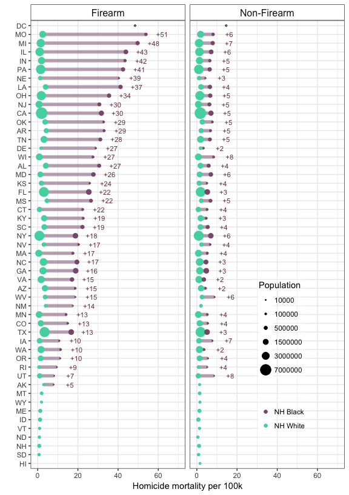
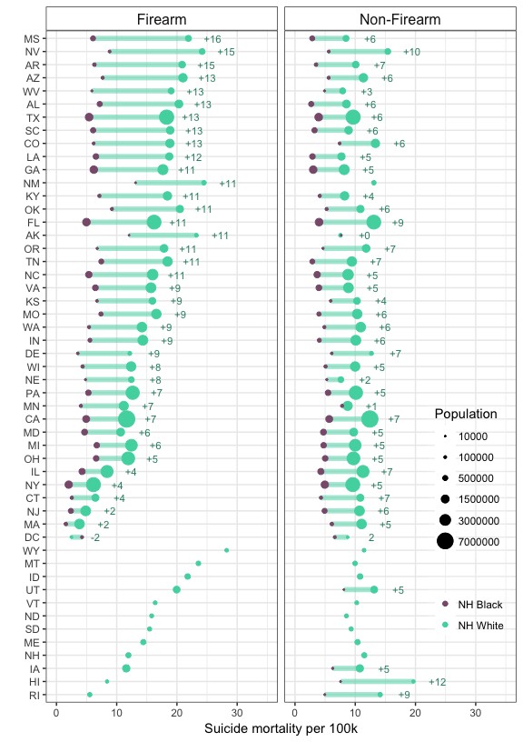
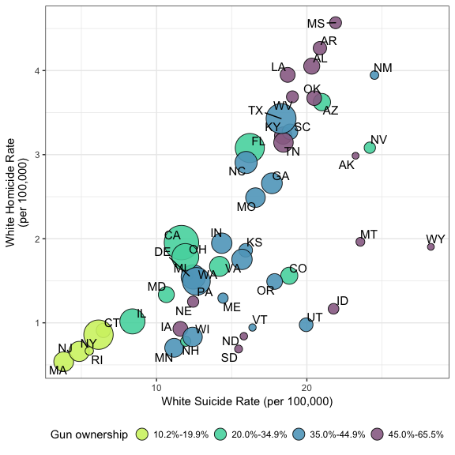
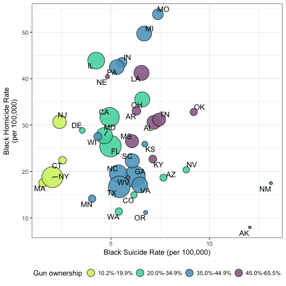

Corinne A Riddell, PhD

Sam Harper, PhD

Magdalena Cerdá, PhD

Jay S Kaufman, PhD

CAR, SH, and JSK: Department of Epidemiology, Biostatistics &
Occupational Health, McGill University, 1020 Pine Avenue West, Room 27,
Montreal, QC H3A 1A2, Canada.

MC: Violence Prevention Research Program, Department of Emergency
Medicine, University of California, Davis, USA.

Address correspondence to: Corinne Riddell, PhD, Department of
Epidemiology, Biostatistics & Occupational Health, McGill University,
1020 Pine Avenue West, Room 27, Montreal, QC H3A 1A2, Canada. Email:
<corinne.riddell@mail.mcgill.ca>. Phone: +1-438-863-0402

Word Count: 2700

##### PAGE BREAK

Abstract
========

**Background:** It is unknown whether and how much the difference in
excess deaths due to homicide among black men and suicide among white
men vary by US state. Such knowledge could inform social policy aimed
towards reducing social disparities in health.

**Objective:** Estimate the absolute inequality between non-Hispanic
black and white men in firearm- and non-firearm-related homicide and
suicide across US states.

**Design:** Surveillance study.

**Setting:** 50 states and the District of Columbia, 2008 to 2014.

**Participants:** Non-Hispanic black and non-Hispanic white males, all
ages.

**Measurements:** Absolute risks and risk differences in firearm- and
non-firearm-related homicide and suicide for black and white men.

**Results:** 71,217 homicides and 191,909 suicides were included in this
analysis. Black-white differences in rates of firearm-related homicide
and suicides varied widely across states. Relative to white men, black
men experienced between 5 and 51 additional homicides per 100,000 men
per year, with black men in Indiana, Michigan, Missouri, Pennsylvania,
and Wisconsin all having more than 40 additional homicides per 100,000.
White men experienced between -2 and 16 additional suicides per 100,000,
with the largest inequalities measured in Southern and Western states,
and smallest inequalities in densely populated Northeastern states.

**Limitations:** Non-firearm suicides may be misclassified as
unintentional injury deaths. This analysis focused on deaths only, and
does not examine rates and inequalities in non-fatal violence.

**Conclusion:** The large variation in the risks of violence and their
racial inequalities highlights states where policies are most urgently
needed to reduce violence and their racial inequalities. Future research
linking these variations with the social, cultural, and policy
environments are needed to identify settings that support reduced rates
of violence for all Americans.

##### PAGE BREAK

Introduction
============

Non-Hispanic black males are nearly 10 times more likely to die from
homicide than non-Hispanic white males in the United States, whereas
white males are 2.5 times more likely to die from suicide.1
74% of these homicides and 57% of these suicides involved firearms, and
the relative racial inequalities in violent deaths are especially marked
for firearm-related homicide and slightly increased for firearm-related
suicide; Black males are 13.5 times more likely to die of a
firearm-related homicide than white males, whereas white males are 2.6
times as likely to die from firearm-related suicide.1

While racial inequalities in violent deaths are well-established for the
United States overall, it is unknown whether and how much they vary by
state. Large variation in racial inequalities among spatially contiguous
or otherwise similar states may reflect differences in the social,
cultural, and policy environments worthy of further investigation.
Quantifying state-level heterogeneity is the first step towards
implementing targeted policies aimed at reducing violence and
inequalities where they are most urgently needed.

Across the US, states with the highest levels of household gun ownership
have higher rates of firearm-related suicide and homicide.2
Ecologic studies comparing US states have estimated positive
associations between rates of gun ownership and firearm-related homicide
and suicide rates,3,4,5,6,7 and case-control studies have
found positive associations between having a gun in the home and an
individual’s risk of homicide occurring at home,8 and with
the overall risk of suicide.9 When considering the causal
pathway to homicide or suicide, two component causes are motivation and
opportunity.10 Gun availability or ownership increases
opportunity and it is plausible that motivation varies by racial group.
Thus, the relationship between gun availability and violence may be
differential by race. This information is currently unknown but is
important to inform whether policies aimed at reducing gun prevalence
may have differential effects among blacks and whites.

In this study, we aimed to: (1) Estimate the absolute inequality between
non-Hispanic black and white men in firearm- and non-firearm-related
homicide and suicide across US states; (2) Examine the relationships
between state gun ownership prevalence, firearm-related homicide, and
firearm-related suicide, separately for black and white men.

Methods
=======

We used the Center for Disease Control and Prevention’s Web-based Injury
Statistics Query and Reporting System (WISQARS) Fatal Injury Mapping
tool to abstract the age-adjusted number of firearm fatalities for males
in every state during 2008 to 2014 for non-Hispanic whites and
non-Hispanic blacks, by intent (homicide or suicide), and firearms
involvement. Throughout this paper we refer to this population as men
since the vast majority of deaths occurred after childhood. The data
were suppressed by WISQARS for race-state strata with 10 or fewer actual
deaths between 2008 and 2014, and could not be used in these analyses.
We computed the average annual fatality rate according to race, intent,
and firearms involvement by dividing the number of fatalities by the
total population estimate (i.e., the summation of population estimates
over 2008 to 2014) and we calculated the absolute inequality (risk
difference) in estimates between black and white men. For homicide, we
subtract the fatality rate of white men from that of black men, and for
suicide these rates are reversed, such that the estimated risk
differences are mostly positive and interpreted as the number of
additional deaths to black (white) men due to homicide (suicide)
associated with the heightened fatality rate experienced by black
(white) men. We did not calculate confidence intervals because there was
no sampling, and thus no sampling error. To reflect varying population
sizes among states and by race, we size the data markers according to
race-specific average annualized population size.

To examine the relationships between gun prevalence, firearm-related
homicide, and firearm-related suicide by race, we used the last
available state-level estimates of household firearm ownership from the
National Behavioral Risk Factor Surveillance System (BRFSS) from 2004.
The BRFSS is an annual telephone survey on the non-institutionalized
adult population that asks respondents about their health-related risk
behaviors, chronic health conditions, and use of preventive services. In
2001, 2002, and 2004, the BRFSS asked, “Are any firearms kept in or
around your home?” 293,882 people responded to this question and
estimates of household gun ownership prevalence (%) by state were
computed previously and ranged between 10.2% in Hawaii and 65.5% in
Wyoming.11 Given that individuals may under-report gun
ownership, and that state gun prevalence may have shifted since 2004, we
grouped states into four broad categories of gun prevalence: (i) 10% -
19.9%, (ii) 20% - 34.9%, (iii) 35% - 44.9%, and (iv) 45% - 66%, to
provide a fair proxy for current levels of ownership.

We then visually assessed the relationships between state gun
prevalence, firearm-related homicide, and firearm-related suicide by
graphing the rate of firearm-related homicide as a function of
firearm-related suicide and shaded the points by category of gun
prevalence, separately for black men and white men. Correlation between
rates of firearm-related homicide and suicide would imply that
conditions that generate variation in homicide also generate variation
in suicide, such as cultural, social, or economic conditions, including
state gun prevalence or the firearm policy environment. Thus, the
purpose of this descriptive exercise is to illustrate whether states
with relatively high rates of firearm-related homicide also have
relatively high rates of firearm-related suicide, and if this pattern
exists for both black men and white men and is associated with state gun
ownership.

The analysis was performed in R version 3.3.2.12 No
institutional ethical review was required since this study used publicly
accessible data.13 A replication data set including the raw
data and statistical code to reproduce the manuscript is publicly
available on GitHub:
<https://github.com/corinne-riddell/InjuryDisparity/>.

**Funding Source**

This research was not formally supported by a research grant, although
one of the co-authors was supported by the National Institutes of Health
(\#1R21 DA041154-01).

Results
=======

There were 71,217 homicides and 191,909 suicides during 2008 to 2014
included in this analysis. Homicide deaths were suppressed for black men
in 11 states (Alaska (non-firearm only), New Mexico (non-firearm only)
Montana, Wyoming, Maine, Idaho, Vermont, North Dakota, New Hampshire,
South Dakota, and Hawaii), and for white men in DC. Suicide deaths were
suppressed in 12 states for black men (Montana, Wyoming, Maine, Idaho,
Vermont, North Dakota, New Hampshire, South Dakota, Hawaii (firearm
only), Utah (firearm only), Iowa (firearm only), and Rhode Island
(firearm only)).

**Figure 1** displays the rates of homicide among black men compared to
white men, according to state and firearms use. The black-white
difference in homicide fatality rates varied strikingly by state,
between 5 and 51 per 100,000 per year, and was driven by marked
variation in firearm homicides to black men across states. States with
the smallest black firearm homicide rates saw fewer than 15 deaths per
100,000 per year over the time period, compared to more than 40 deaths
per 100,000 per year in states with the highest rates. Homicide rates
for white men showed relatively little variation, between 1 and 5 deaths
per 100,000 per year. The states with the highest rates of firearm
homicide for black men (e.g., Missouri, Michigan, Illinois, Indiana)
also had the largest differences in rates between blacks and whites,
signaling settings that were most dangerous for blacks but relatively
safe for whites. The District of Columbia also had a high rate of
firearm homicide for blacks, but its rate for white men was suppressed.
Given its abstracted cumulative population denominator of 767,586, this
implies a rate ≤ 10 per 767,586, or 1.3 per 100,000, implying that DC
was also relatively dangerous for black men, but not for white men.

Georgia, New York, Florida, Texas, and California are the states with
the largest black populations. Among them, Texas exhibited the smallest
black-white difference in firearm-related homicide (13 additional deaths
to black men per 100,000), which was also substantially lower than the
differences estimated for neighboring states like Louisiana (+37),
Oklahoma (+29), and Arkansas (+29). Georgia (+16) and Florida (+22) had
differences close to nearby South and North Carolina (+19 and +17,
respectively), while having lower rates than Alabama (+27) and Tennessee
(+28). New York's difference (+18) was similar to Massachusetts (+17)
and Connecticut (+22), but was substantially lower than the rates of
neighboring New Jersey (+30) and Pennsylvania (+41). California
exhibited the largest black-white difference (+30) in firearm-related
homicide among the five states with the largest black populations, which
was larger than the rates estimates for contiguous states like Nevada
(+17) and Oregon (+10), although these states had relatively small black
populations.

Although non-firearm homicides are much more rare, they also
demonstrated the general pattern of heightened rates among black men
compared to white men. Whereas black men experienced annual rates that
varied between 3 and 15 per 100,000 by state, white rates varied between
1 and 3 per 100,000. Across the US, firearm homicide rates were higher
than non-firearm rates for black men, and were more than 5.3 times
higher in all states in the East North Central region (Wisconsin,
Illinois, Indiana, Ohio, and Michigan), and in Missouri, Louisiana,
Delaware, and Nebraska.

In contrast to homicide, suicide fatality rates were higher among white
men compared to black men, independent of firearms involvement, with the
exception of firearm-related suicide in DC (**Figure 2**). The
white-black difference in suicides involving a firearm varied from -2
per 100,000 in the District of Columbia to 16 per 100,000 per year in
Missouri, although differences could not be estimated for 12 states with
10 or fewer firearm-related suicides among blacks. The annual rate of
suicide involving firearms varied more markedly for white men than for
black men: between 2 per 100,000 in DC and 28 per 100,000 in Wyoming for
white men, compared to a range of 2 per 100,000 in Massachusetts to 13
per 100,000 in New Mexico among black men.

Seven of the ten states with the largest white-black differences in
firearm-related suicide are located in the South, including Mississippi,
Arkansas, West Virginia, Alabama, Texas, South Carolina, and Louisiana,
while the remaining three are in the West, including Nevada, Arizona,
and Colorado (+12 and 16 per 100,000 per year). Along with DC, the
mid-Atlantic states of Massachusetts, New Jersey, Connecticut, and New
York had the smallest white-black differences (&lt;4 per 100,000 per
year) in firearm-related suicide. Importantly, these states also tended
to have the lowest firearm-related suicide rates for both black men and
white men, implying that the safest states (in terms of suicide risk)
for black men and white men are the same.

The rates of black- and white- non-firearm-related suicides and the
difference between them varied substantially less than those involving
firearms. For white men, between 8 per 100,000 in Alaska and 20 per
100,000 in Hawaii non-firearm-related suicides were committed each year
on average across the states, compared to 3 per 100,000 in Alabama and 8
per 100,000 in Utah among black men.

The five states with jointly low rates of firearm-related homicide and
suicide among white men (i.e., Massachusetts, New Jersey, Rhode Island,
New York, and Connecticut) were also in the lowest category of reported
gun prevalence (**Figure 3**). Furthermore, many of the states with the
highest violence rates belonged to the highest category of gun
prevalence, while most states located in the middle of the graph
belonged to the middle categories of gun prevalence. Notably, several
states that belonged to the highest gun prevalence category had
relatively low rates of firearm-related homicide, including Iowa,
Nebraska, the Dakotas, Idaho, Montana, and Wyoming. Generally speaking,
the strong linear relationship between firearm-related homicide and
suicide among white men suggests that the characteristics that generate
variation in homicide and suicide in this racial/ethnic group were
similar.

Among black men, states with the lowest reported prevalence of guns had
the lowest rates of firearm-related suicide, and below-average rates of
firearm-related homicide (**Figure 4**). States with the highest rates
of violence (i.e., Mississippi, Missouri, Oklahoma) had heightened rates
of gun prevalence, although several Southern states with relatively high
gun prevalence had relatively low rates of firearm-related homicide. The
weak relationship between firearm-related homicide and suicide among
black men implies that the set of characteristics that generated
variation in firearm-related homicide among black men are different from
the characteristics that generated variation in firearm-related suicide.

Discussion
==========

Using data from all 50 US states and DC, our study illustrates striking
variation in the inequality in firearm-related homicide. Black men
experienced between 5 and 51 additional homicides per 100,000, and the
magnitude of the difference was largely driven by differences among
states in homicide rates for black men. Rust-belt states reported the
most firearm homicides among black men and medium levels of gun
ownership. In the South, states with high levels of gun ownership, such
as Louisiana, reported higher homicide rates among black men than states
with medium levels, such as Texas. Disentangling the factors that make
several Southern states relatively safe for black men and the rust-belt
states relatively unsafe compared to white men should be a high priority
in order to reduce health inequalities and foster communities that offer
equal safety independently of race. Sociologists have found that
structural disadvantage (i.e., concentrated poverty, joblessness, family
disruption),14 racial residential
segregation,15,16,17,18 and participation in drug
markets19,20 are implicated in the higher risk of homicide
among black men relative to white men. Thus, multilevel research could
incorporate state factors (i.e., gun ownership, and gun policy)
alongside these neighborhood and individual characteristics to describe
how layers of the social environment affect homicide and inequality.

White men were at increased risk for firearm-related suicide, and
experienced between -2 and 16 additional suicides per 100,000 compared
to black men. The range in the suicide rate across states for white men
was large, although less than the range in the homicide rate for black
men. State gun prevalence was strongly tied to firearm-related suicide
for both black and white men, and is the most lethal means of attempted
suicide.21,22 States that were the safest also have some of
the country's most restrictive gun laws,23 highlighting the
bidirectional relationship between gun policy and gun ownership, and the
constellation of factors associated with the lowest risks of suicide in
the country. Alcohol is another important risk factor for suicide, both
in terms of history of alcoholism and overuse at the time of
suicide.24,25 Alcohol was found in the systems of 25% of
white male suicides tested and 15% of black males suicides in
2005--2006, with 16% of the white men being described as alcohol
dependent at the time of suicide compared to 7% of black
men.26 Given that white men have higher rates of alcohol
abuse than black men,26 alcohol use might be implicated both
in the direction of the white-black inequality and its variation across
states.

This study is subject to several limitations. In terms of the listed
cause of death used to identify suicides and homicides, non-firearm
suicides may be mistakenly coded as unintentional injuries or vice
versa, and it may be especially difficult to determine intent from drug
or alcohol overdoses. We considered only fatal outcomes, not attempted
suicides and homicides. Given that firearm suicide attempts are more
than 80% fatal,21,22 and firearm homicide attempts are
approximately 20% fatal,27 studying only fatal outcomes
misses the morbidity endured during nonfatal assaults and suicide
attempts. We were limited to contrasting age-standardized mortality
rates, but would have rather contrasted age-specific rates, had there
been more deaths. We did not examine women because their risks of
homicide and suicide are much lower than for men, and data for black
women were suppressed for more than half of the states. Finally, these
results are purely descriptive and make no claims regarding causal
mechanisms. Our purpose was to describe how much inequalities in
violence vary across the United States in order to provide a foundation
for future research linking these differences to variations in the
social, cultural, and environmental settings where black and white
communities are based, including variations in firearm policy and access
to firearms.

Firearms feature differently in the deaths of black and white men in the
United States. The large variation in the homicide and suicide rates and
their racial differences across states places a spotlight on states
where policies are most urgently needed to reduce rates of violence, and
their racial inequalities. This research provides the first step in
measuring these inequalities across states, which can be further studied
to identify the policies, and social and cultural factors that support
reduced rates of violence for all Americans.

Figure Legends
--------------

### Figure 1: Difference in age-standardized homicide fatalities rates for men by state, firearms, and race, 2008-2014

### Figure 2: Difference in age-standardized suicide fatalities rates for men by state, firearms, and race, 2008-2014

### Figure 3: The relationship between the annual rates of homicide and suicide among white men by state and reported firearm ownership, 2008-2014

### Figure 4: The relationship between the annual rates of homicide and suicide among black men by state and reported firearm ownership, 2008-2014

**Acknowledgements:** Corinne Riddell is a post-doctoral researcher at
McGill University, and received salary support from the Department of
Epidemiology, Biostatistics, and Occupational Health. Sam Harper is
supported by a Chercheur Boursier Junior 2 from the Fonds de la
Recherche en Santé du Québec. Magdalena Cerdá is a CAMPOS Faculty
Scholar, ADVANCE Program at the University of California, Davis and
supported by the National Institutes of Health (\#1R21 DA041154-01).

### References

1.  Statistics, Programming & Economics Branch, National Center for
    Injury Prevention & Control, Centers for Disease Control
    and Prevention. Fatal injury mapping. Available from:
    <https://wisqars.cdc.gov:8443/cdcMapFramework/>. \[cited 3
    Oct 2017\].

2.  Miller M, Azreal D, Hemenway D. Firearms and violent death in the
    United States. In: Webster DW, Vernick JS, eds. *Reducing Gun
    Violence in America. Informing Policy with Evidence and Analysis*.
    Baltimore: The Johns Hopkins University Press; 2013:14-15.

3.  Miller M, Azrael D, Hemenway D. Rates of household firearm ownership
    and homicide across us regions and states, 1988–1997. *American
    Journal of Public Health*. 2002;92(12):1988-1993.

4.  Miller M, Hemenway D, Azrael D. State-level homicide victimization
    rates in the us in relation to survey measures of household firearm
    ownership, 2001–2003. *Social Science &
    Medicine*. 2007;64(3):656-664.

5.  Siegel M, Ross CS, King III C. The relationship between gun
    ownership and firearm homicide rates in the united
    states, 1981–2010. *American Journal of Public Health*. 2013.

6.  Miller M, Barber C, White RA, Azrael D. Firearms and suicide in the
    United States: Is risk independent of underlying suicidal behavior?
    *American Journal of Epidemiology*. 2013;178(6):946-955.

7.  Miller M, Lippmann SJ, Azrael D, Hemenway D. Household firearm
    ownership and rates of suicide across the 50 United States. *Journal
    of Trauma and Acute Care Surgery*. 2007;62(4):1029-1035.

8.  Kellermann AL, Rivara FP, Rushforth NB, et al. Gun ownership as a
    risk factor for homicide in the home. *New England Journal of
    Medicine*. 1993;329(15):1084-1091.

9.  Kellermann AL, Rivara FP, Somes G, et al. Suicide in the home in
    relation to gun ownership. *New England Journal of
    Medicine*. 1992;327(7):467-472.

10. Kubrin CE, Wadsworth T. Explaining suicide among blacks and whites:
    How socioeconomic factors and gun availability affect race-specific
    suicide rates. *Social Science Quarterly*. 2009;90(5):1203-1227.

11. Monuteaux MC, Lee LK, Hemenway D, Mannix R, Fleegler EW. Firearm
    ownership and violent crime in the us: An ecologic study. *American
    journal of Preventive Medicine*. 2015;49(2):207-214.

12. R Core Team. *R: A Language and Environment for Statistical
    Computing*. Vienna, Austria: R Foundation for Statistical
    Computing; 2014. <http://www.R-project.org/>.

13. Canadian Institutes of Health Research, National Sciences and
    Engineering Research Council of Canada, and Sciences Sciences and
    Humanities Research Council of Canada. *Tri-council policy
    statement: Ethical conduct for research involving humans*,
    December 2014.

14. Wilson WJ. *The Truly Disadvantaged: The Inner City, the Underclass,
    and Public Policy*. University of Chicago Press; 1987.

15. Massey D. *Problem of the Century*. New York: Russell
    Sage; 2001:314-344.

16. Ousey GC, Kubrin CE. Exploring the connection between immigration
    and violent crime rates in US cities, 1980–2000. *Social
    Problems*. 2009;56(3):447-473.

17. Shihadeh ES, Flynn N. Segregation and crime: The effect of black
    social isolation on the rates of black urban violence. *Social
    Forces*. 1996;74(4):1325-1352.

18. Peterson RD, Krivo LJ. Racial segregation and black urban homicide.
    *Social Forces*. 1993;71(4):1001-1026.

19. Blumstein A. Youth violence, guns, and the illicit-drug industry.
    *The Journal of Criminal Law and Criminology*. 1995;86(1):10-36.

20. Fryer RG, Heaton PS, Levitt SD, Murphy KM. Measuring crack cocaine
    and its impact. *Economic Inquiry*. 2013;51(3):1651-1681.

21. Spicer RS, Miller TR. Suicide acts in 8 states: Incidence and case
    fatality rates by demographics and method. *American Journal of
    Public Health*. 2000;90(12):1885.

22. Miller M, Azrael D, Hemenway D. The epidemiology of case fatality
    rates for suicide in the Northeast. *Annals of Emergency
    Medicine*. 2004;43(6):723-730.

23. Siegel M, Pahn M, Xuan Z, et al. Firearm-related laws in all 50 US
    states, 1991–2016. *American Journal of Public
    Health*. 2017;(0):e1-e8.

24. Mościcki EK. Identification of suicide risk factors using
    epidemiologic studies. *Psychiatric Clinics of North
    America*. 1997;20(3):499-517.

25. Mościcki EK. Epidemiology of completed and attempted suicide: Toward
    a framework for prevention. *Clinical Neuroscience
    Research*. 2001;1(5):310-323.

26. Disease Control C for, Prevention. Alcohol and suicide among
    racial/ethnic populations — 17 states, 2005–2006.
    *MMWR*. 2009;58:638-640.

27. Cook PJ, Rivera-Aguirre AE, Cerdá M, Wintemute G. Constant lethality
    of gunshot injuries from firearm assault: United states, 2003–2012.
    *American Journal of Public Health*. 2017;107(8):1324-1328.
